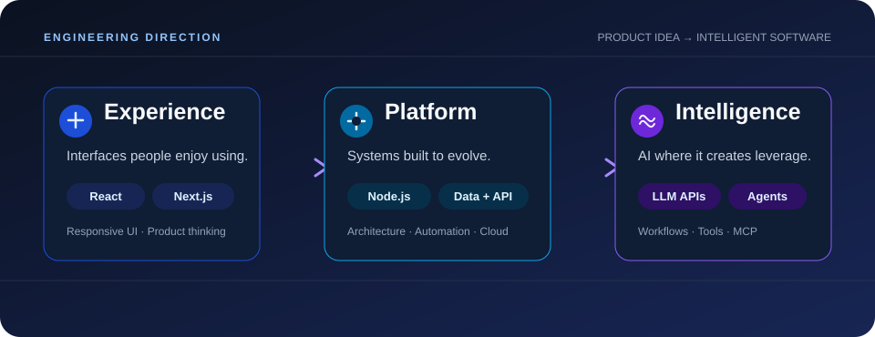
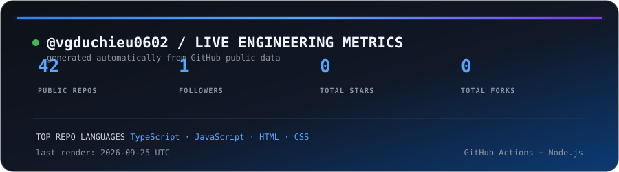

  
  

<b>Full-stack developer building web applications and AI-powered workflows.</b>

## Tech stack

  

## Full-stack + AI

## Selected work

| Project | What I am exploring | Stack |
| --- | --- | --- |
| **HRM / ERP Platform** | RBAC · Payroll · Background jobs | `TypeScript` `Node.js` `MongoDB` |
| **Marine Data Platform** | Crawlers · Normalize · Fallback sources | `Node.js` `MongoDB` `API Design` |
| [**Eshop Ecommerce**](https://github.com/vgduchieu0602/Eshop-Ecommerce) | Commerce platform | `React` `Node.js` `Database` |
| [**HoangNhuAI**](https://github.com/vgduchieu0602/HoangNhuAI) | AI workflows | `LLM APIs` `Agents` |

## GitHub activity

  <picture>
    <source media="(prefers-color-scheme: dark)" srcset="./assets/github-snake-dark.svg">
    <source media="(prefers-color-scheme: light)" srcset="./assets/github-snake.svg">
    
  </picture>

